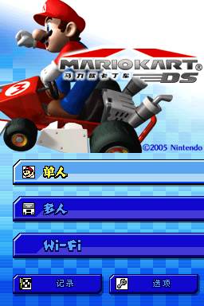

# 《马力欧卡丁车DS》汉化

[](https://creativecommons.org/licenses/by-nc-sa/4.0/legalcode)

## 基本说明

本项目是对 Nintendo DS 游戏《马力欧卡丁车DS》（<span lang="ja">マリオカートDS</span>）的简体中文本地化。

译名以最新的任天堂官方中文翻译为准，部分简繁不一致的译名参考任天堂译名习惯选取繁体中文译名。

关于 DS Download Play：由于 DS Download Play 受字库大小限制较严重，因此本项目提供两种补丁，即“通常版”和“Download Play 版”。前者无法正常使用 DS Download Play 功能；后者虽然能够正常使用 DS Download Play 功能，但字体表现受到限制（例如不能使用日文假名）。请按照需求使用。并且由于 DS Download Play 存在签名校验，少量文本无法翻译成中文，但基本不影响正常游戏。

如需转载，请保留此说明。

## 汉化名单

**汉化组 汉化**

- **破解**：
- **翻译**：
- **美工**：
- **测试**：

## 使用方式

请自行获取游戏日本版 ROM，然后下载汉化补丁并解压，按照补丁应用工具“NitroPatcher”的说明进行操作。补丁压缩包中包含了 Microsoft Windows 平台的补丁应用工具，其他平台的工具可通过下方下载地址获取。

日本版 ROM 校验码（[No-Intro](https://datomatic.no-intro.org/index.php?page=show_record&s=28&n=0228)）：

- CRC32：`226e8db6`
- MD5：`67b9666b1dbaaf1e8ca03bf7786ed5b6`
- SHA-1：`a4c790b6cd1e45a9728001081845c17f06985a17`

汉化补丁下载地址：

- GitHub：<https://github.com/Qi-Busiyi-Hanhuazu/MKDSChsLocalization/releases/download/v1.0.0/MKDSChsLocalization.v1.0.0.zip>
- 百度网盘：<https://pan.baidu.com/s/1KLHwLwhdHQzB2qojiKH21A?pwd=mkds>

补丁应用工具下载地址：

- GitHub：<https://github.com/Xzonn/NitroPatcher/releases/latest/>
- 百度网盘：<https://pan.baidu.com/s/1vXynSX1WauU3FeGHDnrDfg?pwd=ntro>

## 截图预览
  

## 授权协议

本项目使用 **[CC BY-NC-SA 4.0](https://creativecommons.org/licenses/by-nc-sa/4.0/legalcode)** 协议授权。若您想基于本项目进行二次创作，请遵守协议内容。这些内容主要包括：

- **署名**：您必须标明本项目的作者，并在您的作品中提供指向本项目的链接。
- **非商业性使用**：您不得将本项目用于商业目的。
- **相同方式共享**：若您基于本项目进行二次创作，您必须以相同的协议授权您的作品。

请阅读本项目的 **[完整授权协议](LICENSE.txt)** 以了解更多信息。

## 构建方式
### 前提条件

- [Python 3.10+](https://www.python.org/downloads/)（`pip install -r requirements.txt`）
- [PowerShell 5.0+](https://learn.microsoft.com/powershell/)
- 字体文件（默认读取以下文件：`files/fonts/Zfull-GB.ttf`）

### 构建
在 PowerShell 中运行：

```
. scripts\build_patch.ps1
```
